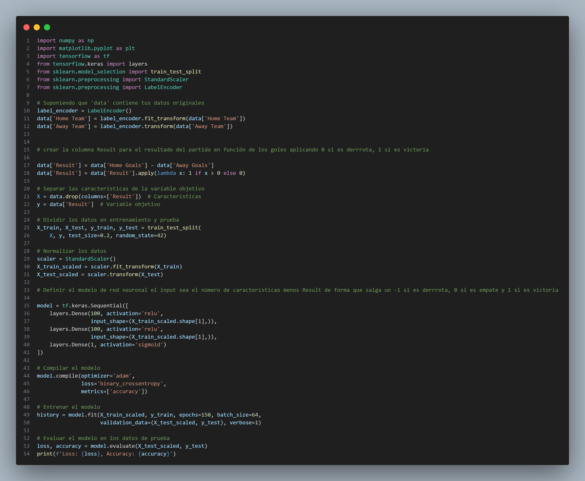
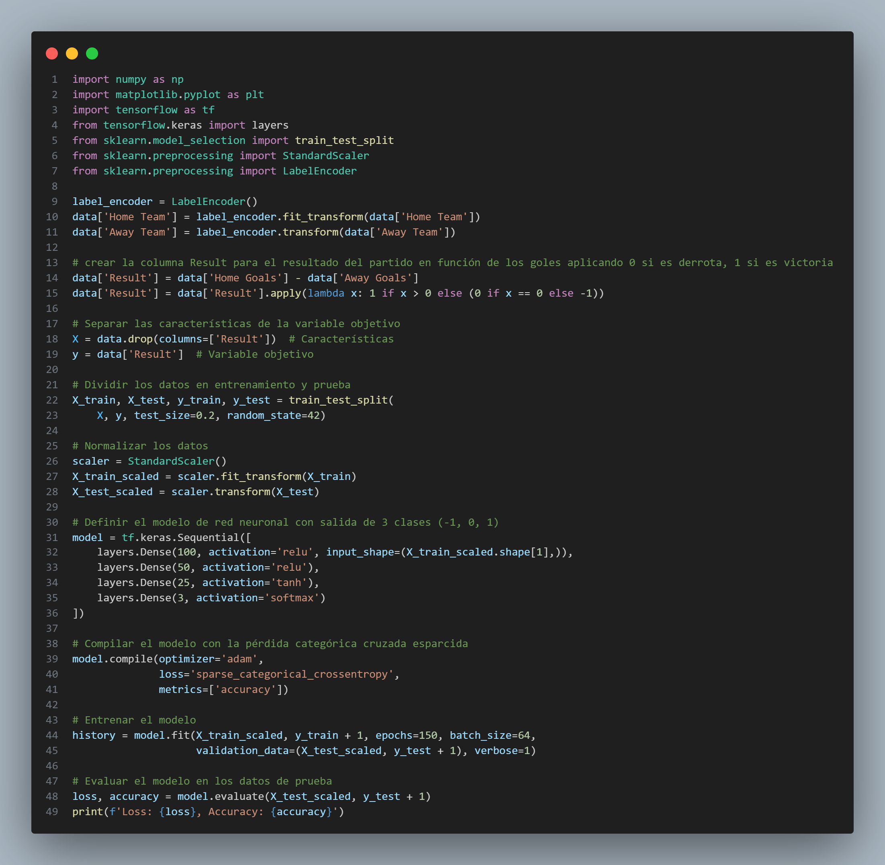
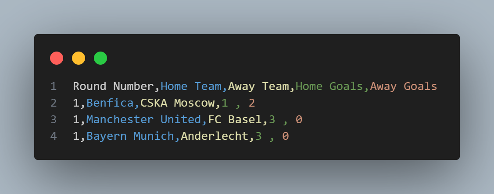
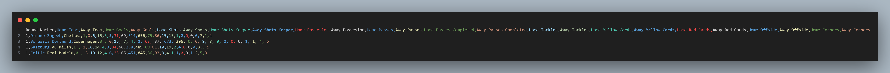
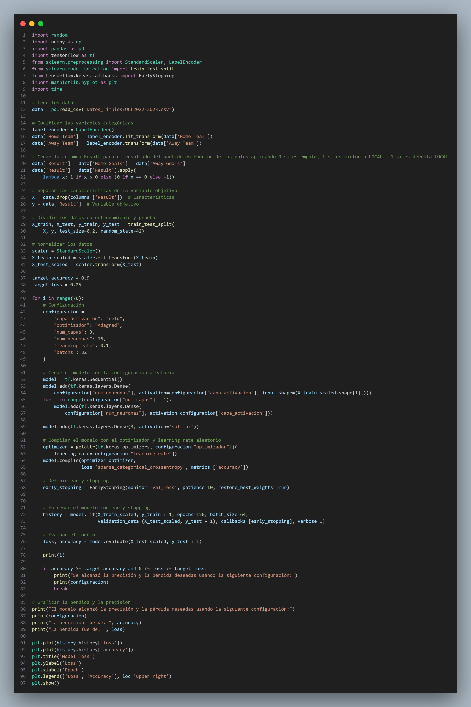

<h1 align="center">Simulador Champions League 2023-2024</h1>

En este [repositorio](https://github.com/Diegodesantos1/Limpieza_de_datos) queda resuelta la práctica de los análisis y limpieza de datos.

<h2 align="center">Índice</h2>

1. [Obtención de datos](#obtención-de-datos)
2. [Limpieza de datos](#limpieza-de-datos)
3. [Análisis Inicial](#análisis-inicial)
4. [Regresión Lineal y Clustering](#regresión-lineal-y-clustering)
5. [Red Neuronal](#red-neuronal)
6. [Predicciones](#predicciones)
7. [Resultados](#resultados)


## Obtención de datos
He descargado varios CSV con la información principal desde esta [página](https://fixturedownload.com/results/champions-league-2022)

Después he hecho Scrapping para obtener datos del coeficiente uefa:

```python
import requests
from bs4 import BeautifulSoup
import pandas as pd

def scrapeo():
    url = 'https://kassiesa.net/uefa/data/method5/trank10-2024.html'

    page = requests.get(url)
    soup = BeautifulSoup(page.content, 'html.parser')

    # Buscar la tabla con los datos
    table = soup.find_all('table')[0]

    # Crear un DataFrame con los datos directamente del contenido HTML
    df = pd.read_html(str(table), header=[0, 1])[0]

    # Asignar nombres a las columnas
    columnas = ["Position", "-", "Club", "Country", "14/15", "15/16", "16/17", "17/18", "18/19",
                "19/20", "20/21", "21/22", "22/23", "23/24", "Title Points", "Total Points", "Country Part"]
    df.columns = columnas

    # Eliminar las columnas que no interesan
    df = df.drop(df.columns[[1, 3, 16]], axis=1)

    # Guardar la primera fila
    primera_fila = df.iloc[0]

    # Eliminar las filas que contienen los países especificados
    paises = ['Spain', 'England', 'Germany', 'Italy', 'France', 'Portugal', 'Netherlands', 'Russia', 'Belgium', 'Ukraine', 'Turkey', 'Austria', 'Czech Republic', 'Switzerland', 'Scotland', 'Denmark', 'Scotland', 'Greece', 'Croatia', 'Norway', 'Serbia', 'Israel', 'Cyprus', 'Poland', 'Sweden', 'Azerbaijan', 'Bulgaria', 'Romania', 'Slovakia', 'Hungary',
            'Kazakhstan', 'Belarus', 'Slovenia', 'Liechtenstein', 'Moldova', 'Finland', 'Ireland', 'Bosnia-Herzegovina', 'Iceland', 'Latvia', 'Armenia', 'Lithuania', 'Albania', 'Faroe Islands', 'Luxembourg', 'Kosovo', 'North Macedonia', 'Malta', 'Northern Ireland', 'Georgia', 'Estonia', 'Wales', 'Montenegro', 'Gibraltar', 'Andorra', 'San Marino']
    df = df[~df['Club'].isin(paises)]

    # Convertir los valores en la columna 'Position' a numéricos
    df['Position'] = pd.to_numeric(df['Position'], errors='coerce')

    # Rellenar los valores NaN con el método ffill
    df['Position'] = df['Position'].fillna(method='ffill')

    # Convertir los valores a enteros
    df['Position'] = df['Position'].astype('Int64')

    # Añadir la fila específica al DataFrame
    nueva_fila = pd.DataFrame([[1, '-', 'Real Madrid', '-', 29.0, 33.0, 33.0, 32.0,
                            19.0, 17.0, 26.0, 30.0, 29.0, 21.0, 94.0, 363.0, '-']], columns=columnas)
    df = pd.concat([nueva_fila, df], ignore_index=True)

    # Eliminar las columnas que no interesan
    df = df.drop(df.columns[[1, 3, 16]], axis=1)

    # Guardar el DataFrame en un archivo CSV
    df.to_csv('Datos_Limpios/UEFA_Ranking.csv', index=False)

# scrapeo()
```

## Limpieza de datos

Ahora comenzamos con la limpieza de todos los datos:

```python
import numpy as np
import pandas as pd


datos = ["Datos/champions-league-2017-UTC.csv", "Datos/champions-league-2018-UTC.csv", "Datos/champions-league-2019-UTC.csv",
         "Datos/champions-league-2020-UTC.csv", "Datos/champions-league-2021-UTC.csv", "Datos/champions-league-2022-UTC.csv"]

nombres = ["2017-2018", "2018-2019", "2019-2020",
           "2020-2021", "2021-2022", "2022-2023"]


for i in range(len(datos)):
    # Leer el archivo CSV
    df = pd.read_csv(datos[i])

    # Crear una copia del dataframe
    df_trabajar = df.copy()

    # Eliminar las columnas Match Number, Date, Location, Group
    df_trabajar = df_trabajar.drop(
        ['Match Number', 'Date', 'Location', 'Group'], axis=1)

    # Guardar el dataframe en un archivo CSV
    df_trabajar.to_csv("Datos_Limpios/UCL" +
                       nombres[i] + ".csv", index=False)


datos_limpios = ["Datos_Limpios/UCL2014-2015.csv", "Datos_Limpios/UCL2015-2016.csv", "Datos_Limpios/UCL2016-2017.csv", "Datos_Limpios/UCL2017-2018.csv", "Datos_Limpios/UCL2018-2019.csv", "Datos_Limpios/UCL2019-2020.csv",
                 "Datos_Limpios/UCL2020-2021.csv", "Datos_Limpios/UCL2021-2022.csv", "Datos_Limpios/UCL2022-2023.csv", "Datos_Limpios/UCL2023-2024.csv"]

nombres_goles = ["2014-2015", "2015-2016", "2016-2017", "2017-2018",
                 "2018-2019", "2019-2020", "2020-2021", "2021-2022", "2022-2023", "2023-2024"]


# Printeo todos los nombres de los equipos desde 2014-2015 hasta 2022-2023

equipos = set()
for i in range(len(datos_limpios)):
    df = pd.read_csv(datos_limpios[i])
    equipos = equipos.union(set(df['Home Team']))
    equipos = equipos.union(set(df['Away Team']))

equipos = sorted(equipos)
print("\nEquipos\n")

# Primero cambio todos Atletico Madrid', 'Atlético', 'Atlético Madrid', 'Atlético de Madrid' por 'Atletico de Madrid'

for i in range(len(datos_limpios)):
    df = pd.read_csv(datos_limpios[i])
    df['Home Team'] = df['Home Team'].replace(
        ['Atletico Madrid', 'Atlético', 'Atlético Madrid', 'Atlético de Madrid'], 'Atletico de Madrid')
    df['Away Team'] = df['Away Team'].replace(
        ['Atletico Madrid', 'Atlético', 'Atlético Madrid', 'Atlético de Madrid'], 'Atletico de Madrid')
    df.to_csv(datos_limpios[i], index=False)

# Segundo cambio todos los 'FC Bayern Munich', 'Bayern Munich', 'Bayern' por 'Bayern Munich'

for i in range(len(datos_limpios)):
    df = pd.read_csv(datos_limpios[i])
    df['Home Team'] = df['Home Team'].replace(
        ['FC Bayern Munich', 'Bayern Munich', 'Bayern'], 'Bayern Munich')
    df['Away Team'] = df['Away Team'].replace(
        ['FC Bayern Munich', 'Bayern Munich', 'Bayern'], 'Bayern Munich')
    df.to_csv(datos_limpios[i], index=False)

# Tercero cambio todos los 'Borussia Dortmund', 'Dortmund' por 'Borussia Dortmund'

for i in range(len(datos_limpios)):
    df = pd.read_csv(datos_limpios[i])
    df['Home Team'] = df['Home Team'].replace(
        ['Borussia Dortmund', 'Dortmund'], 'Borussia Dortmund')
    df['Away Team'] = df['Away Team'].replace(
        ['Borussia Dortmund', 'Dortmund'], 'Borussia Dortmund')
    df.to_csv(datos_limpios[i], index=False)

# Cuarto cambio todos los 'CSKA Moscow', 'CSKA Moskva' por 'CSKA Moscow'

for i in range(len(datos_limpios)):
    df = pd.read_csv(datos_limpios[i])
    df['Home Team'] = df['Home Team'].replace(
        ['CSKA Moscow', 'CSKA Moskva'], 'CSKA Moscow')
    df['Away Team'] = df['Away Team'].replace(
        ['CSKA Moscow', 'CSKA Moskva'], 'CSKA Moscow')
    df.to_csv(datos_limpios[i], index=False)

# Quinto cambio todos los 'Galatasaray', 'Galatasaray Istanbul' por 'Galatasaray'

for i in range(len(datos_limpios)):
    df = pd.read_csv(datos_limpios[i])
    df['Home Team'] = df['Home Team'].replace(
        ['Galatasaray', 'Galatasaray Istanbul'], 'Galatasaray')
    df['Away Team'] = df['Away Team'].replace(
        ['Galatasaray', 'Galatasaray Istanbul'], 'Galatasaray')
    df.to_csv(datos_limpios[i], index=False)

# Sexto cambio todos los 'Leverkusen', 'Bayer Leverkusen' por 'Bayer Leverkusen'

for i in range(len(datos_limpios)):
    df = pd.read_csv(datos_limpios[i])
    df['Home Team'] = df['Home Team'].replace(
        ['Leverkusen', 'Bayer Leverkusen'], 'Bayer Leverkusen')
    df['Away Team'] = df['Away Team'].replace(
        ['Leverkusen', 'Bayer Leverkusen'], 'Bayer Leverkusen')
    df.to_csv(datos_limpios[i], index=False)

# Septimo cambio todos los FC Porto', 'Porto' por 'FC Porto'

for i in range(len(datos_limpios)):
    df = pd.read_csv(datos_limpios[i])
    df['Home Team'] = df['Home Team'].replace(
        ['FC Porto', 'Porto'], 'FC Porto')
    df['Away Team'] = df['Away Team'].replace(
        ['FC Porto', 'Porto'], 'FC Porto')
    df.to_csv(datos_limpios[i], index=False)

# Octavo cambio todos los 'FC Barcelona', 'Barcelona' por 'FC Barcelona'

for i in range(len(datos_limpios)):
    df = pd.read_csv(datos_limpios[i])
    df['Home Team'] = df['Home Team'].replace(
        ['FC Barcelona', 'Barcelona'], 'FC Barcelona')
    df['Away Team'] = df['Away Team'].replace(
        ['FC Barcelona', 'Barcelona'], 'FC Barcelona')
    df.to_csv(datos_limpios[i], index=False)

# Noveno cambio todos los 'FC Basel', 'Basel' por 'FC Basel'

for i in range(len(datos_limpios)):
    df = pd.read_csv(datos_limpios[i])
    df['Home Team'] = df['Home Team'].replace(
        ['FC Basel', 'Basel'], 'FC Basel')
    df['Away Team'] = df['Away Team'].replace(
        ['FC Basel', 'Basel'], 'FC Basel')
    df.to_csv(datos_limpios[i], index=False)

# Decimo cambio todos los 'FC Schalke 04', 'Schalke 04', 'Schalke' por 'FC Schalke 04'

for i in range(len(datos_limpios)):

    df = pd.read_csv(datos_limpios[i])
    df['Home Team'] = df['Home Team'].replace(
        ['FC Schalke 04', 'Schalke 04', 'Schalke'], 'FC Schalke 04')
    df['Away Team'] = df['Away Team'].replace(
        ['FC Schalke 04', 'Schalke 04', 'Schalke'], 'FC Schalke 04')
    df.to_csv(datos_limpios[i], index=False)
# Onceavo cambio todos los 'FC Zenit', 'Zenit' por 'FC Zenit'

for i in range(len(datos_limpios)):
    df = pd.read_csv(datos_limpios[i])
    df['Home Team'] = df['Home Team'].replace(
        ['FC Zenit', 'Zenit'], 'FC Zenit')
    df['Away Team'] = df['Away Team'].replace(
        ['FC Zenit', 'Zenit'], 'FC Zenit')
    df.to_csv(datos_limpios[i], index=False)

# Doceavo cambio todos los 'Juventus', 'Juventus Turin' por 'Juventus'

for i in range(len(datos_limpios)):
    df = pd.read_csv(datos_limpios[i])
    df['Home Team'] = df['Home Team'].replace(
        ['Juventus', 'Juventus Turin'], 'Juventus')
    df['Away Team'] = df['Away Team'].replace(
        ['Juventus', 'Juventus Turin'], 'Juventus')
    df.to_csv(datos_limpios[i], index=False)

# Treceavo cambio todos los 'Manchester City', 'Manchester City FC', 'Man City', 'Man. City' por 'Manchester City'

for i in range(len(datos_limpios)):
    df = pd.read_csv(datos_limpios[i])
    df['Home Team'] = df['Home Team'].replace(
        ['Manchester City', 'Manchester City FC', 'Man City', 'Man. City'], 'Manchester City')
    df['Away Team'] = df['Away Team'].replace(
        ['Manchester City', 'Manchester City FC', 'Man City', 'Man. City'], 'Manchester City')
    df.to_csv(datos_limpios[i], index=False)

# Catorceavo cambio todos los 'Manchester United', 'Man United', 'Man. United', 'Manchester United FC' por 'Manchester United'

for i in range(len(datos_limpios)):
    df = pd.read_csv(datos_limpios[i])
    df['Home Team'] = df['Home Team'].replace(
        ['Manchester United', 'Man United', 'Man. United', 'Manchester United FC'], 'Manchester United')
    df['Away Team'] = df['Away Team'].replace(
        ['Manchester United', 'Man United', 'Man. United', 'Manchester United FC'], 'Manchester United')
    df.to_csv(datos_limpios[i], index=False)

# Quinceavo cambio todos los 'Olympiakos', 'Olympiakos Piraeus' por 'Olympiakos'

for i in range(len(datos_limpios)):
    df = pd.read_csv(datos_limpios[i])
    df['Home Team'] = df['Home Team'].replace(
        ['Olympiakos', 'Olympiakos Piraeus'], 'Olympiakos')
    df['Away Team'] = df['Away Team'].replace(
        ['Olympiakos', 'Olympiakos Piraeus'], 'Olympiakos')
    df.to_csv(datos_limpios[i], index=False)

# Dieciseisavo cambio todos los 'Inter", "Internazionale' por 'Internazionale"

for i in range(len(datos_limpios)):
    df = pd.read_csv(datos_limpios[i])
    df['Home Team'] = df['Home Team'].replace(
        ['Inter', 'Internazionale'], 'Internazionale')
    df['Away Team'] = df['Away Team'].replace(
        ['Inter', 'Internazionale'], 'Internazionale')
    df.to_csv(datos_limpios[i], index=False)

# Diecisieteavo cambio todos los 'Milan', 'AC Milan' por 'AC Milan"

for i in range(len(datos_limpios)):
    df = pd.read_csv(datos_limpios[i])
    df['Home Team'] = df['Home Team'].replace(
        ['Milan', 'AC Milan'], 'AC Milan')
    df['Away Team'] = df['Away Team'].replace(
        ['Milan', 'AC Milan'], 'AC Milan')
    df.to_csv(datos_limpios[i], index=False)

# Dieciochoavo cambio todos los 'Tottenham', 'Tottenham Hotspur' por 'Tottenham'

for i in range(len(datos_limpios)):
    df = pd.read_csv(datos_limpios[i])
    df['Home Team'] = df['Home Team'].replace(
        ['Tottenham', 'Tottenham Hotspur'], 'Tottenham')
    df['Away Team'] = df['Away Team'].replace(
        ['Tottenham', 'Tottenham Hotspur'], 'Tottenham')
    df.to_csv(datos_limpios[i], index=False)

# Diecinueveavo cambio todos los Monaco', 'AS Monaco' por 'AS Monaco"

for i in range(len(datos_limpios)):
    df = pd.read_csv(datos_limpios[i])
    df['Home Team'] = df['Home Team'].replace(
        ['Monaco', 'AS Monaco'], 'AS Monaco')
    df['Away Team'] = df['Away Team'].replace(
        ['Monaco', 'AS Monaco'], 'AS Monaco')
    df.to_csv(datos_limpios[i], index=False)

# Veinteavo cambio todos los 'Borussia Mönchengladbach', 'Mönchengladbach' por 'Borussia Mönchengladbach"

for i in range(len(datos_limpios)):
    df = pd.read_csv(datos_limpios[i])
    df['Home Team'] = df['Home Team'].replace(
        ['Borussia Mönchengladbach', 'Mönchengladbach'], 'Borussia Mönchengladbach')
    df['Away Team'] = df['Away Team'].replace(
        ['Borussia Mönchengladbach', 'Mönchengladbach'], 'Borussia Mönchengladbach')
    df.to_csv(datos_limpios[i], index=False)

# Veintiunavo cambio todos los 'Paris Saint-Germain', 'Paris SG', 'PSG' por 'Paris Saint-Germain"

for i in range(len(datos_limpios)):
    df = pd.read_csv(datos_limpios[i])
    df['Home Team'] = df['Home Team'].replace(
        ['Paris Saint-Germain', 'Paris SG', 'PSG', 'Paris'], 'Paris Saint-Germain')
    df['Away Team'] = df['Away Team'].replace(
        ['Paris Saint-Germain', 'Paris SG', 'PSG', 'Paris'], 'Paris Saint-Germain')
    df.to_csv(datos_limpios[i], index=False)

# Veintidosavo cambio todos los 'Real Madrid', 'Real Madrid CF' por 'Real Madrid"

for i in range(len(datos_limpios)):
    df = pd.read_csv(datos_limpios[i])
    df['Home Team'] = df['Home Team'].replace(
        ['Real Madrid', 'Real Madrid CF'], 'Real Madrid')
    df['Away Team'] = df['Away Team'].replace(
        ['Real Madrid', 'Real Madrid CF'], 'Real Madrid')
    df.to_csv(datos_limpios[i], index=False)

# Veintitresavo cambio todos los 'Roma', 'AS Roma' por 'AS Roma"

for i in range(len(datos_limpios)):
    df = pd.read_csv(datos_limpios[i])
    df['Home Team'] = df['Home Team'].replace(
        ['Roma', 'AS Roma'], 'AS Roma')
    df['Away Team'] = df['Away Team'].replace(
        ['Roma', 'AS Roma'], 'AS Roma')
    df.to_csv(datos_limpios[i], index=False)

# Veinticuatroavo cambio todos los 'Sevilla', 'Sevilla FC' por 'Sevilla"

for i in range(len(datos_limpios)):
    df = pd.read_csv(datos_limpios[i])
    df['Home Team'] = df['Home Team'].replace(
        ['Sevilla', 'Sevilla FC'], 'Sevilla')
    df['Away Team'] = df['Away Team'].replace(
        ['Sevilla', 'Sevilla FC'], 'Sevilla')
    df.to_csv(datos_limpios[i], index=False)

# Veinticincoavo cambio todos los 'Shakhtar Donetsk', 'Shakhtar' por 'Shakhtar Donetsk"

for i in range(len(datos_limpios)):
    df = pd.read_csv(datos_limpios[i])
    df['Home Team'] = df['Home Team'].replace(
        ['Shakhtar Donetsk', 'Shakhtar'], 'Shakhtar Donetsk')
    df['Away Team'] = df['Away Team'].replace(
        ['Shakhtar Donetsk', 'Shakhtar'], 'Shakhtar Donetsk')
    df.to_csv(datos_limpios[i], index=False)

# Veintiseisavo cambio todos los 'Valencia', 'Valencia CF' por 'Valencia"

for i in range(len(datos_limpios)):
    df = pd.read_csv(datos_limpios[i])
    df['Home Team'] = df['Home Team'].replace(
        ['Valencia', 'Valencia CF'], 'Valencia')
    df['Away Team'] = df['Away Team'].replace(
        ['Valencia', 'Valencia CF'], 'Valencia')
    df.to_csv(datos_limpios[i], index=False)

# Veintisieteavo cambio todos los 'Lepizig', 'RB Leipzig' por 'RB Leipzig"

for i in range(len(datos_limpios)):
    df = pd.read_csv(datos_limpios[i])
    df['Home Team'] = df['Home Team'].replace(
        ['Lepizig', 'RB Leipzig'], 'RB Leipzig')
    df['Away Team'] = df['Away Team'].replace(
        ['Lepizig', 'RB Leipzig'], 'RB Leipzig')
    df.to_csv(datos_limpios[i], index=False)

# Veintiochoavo cambio todos los 'Atalanta', 'Atalanta BC' por 'Atalanta"

for i in range(len(datos_limpios)):
    df = pd.read_csv(datos_limpios[i])
    df['Home Team'] = df['Home Team'].replace(
        ['Atalanta', 'Atalanta BC'], 'Atalanta')
    df['Away Team'] = df['Away Team'].replace(
        ['Atalanta', 'Atalanta BC'], 'Atalanta')
    df.to_csv(datos_limpios[i], index=False)

# Veintinueveavo cambio todos los 'Ajax', 'AFC Ajax' por 'Ajax"

for i in range(len(datos_limpios)):
    df = pd.read_csv(datos_limpios[i])
    df['Home Team'] = df['Home Team'].replace(['Ajax', 'AFC Ajax'], 'Ajax')
    df['Away Team'] = df['Away Team'].replace(['Ajax', 'AFC Ajax'], 'Ajax')
    df.to_csv(datos_limpios[i], index=False)

# Treintaavo cambio todos los 'Benfica', 'SL Benfica' por 'Benfica"

for i in range(len(datos_limpios)):
    df = pd.read_csv(datos_limpios[i])
    df['Home Team'] = df['Home Team'].replace(
        ['Benfica', 'SL Benfica'], 'Benfica')
    df['Away Team'] = df['Away Team'].replace(
        ['Benfica', 'SL Benfica'], 'Benfica')
    df.to_csv(datos_limpios[i], index=False)

# Treinta y unoavo cambio todos los 'APOEL', 'APOEL Nicosia', 'apoel' por 'Apoel"

for i in range(len(datos_limpios)):
    df = pd.read_csv(datos_limpios[i])
    df['Home Team'] = df['Home Team'].replace(
        ['APOEL', 'APOEL Nicosia', 'apoel'], 'Apoel')
    df['Away Team'] = df['Away Team'].replace(
        ['APOEL', 'APOEL Nicosia', 'apoel'], 'Apoel')
    df.to_csv(datos_limpios[i], index=False)

# Treinta y dosavo cambio todos los 'PSV', 'PSV Eindhoven' por 'PSV"

for i in range(len(datos_limpios)):
    df = pd.read_csv(datos_limpios[i])
    df['Home Team'] = df['Home Team'].replace(
        ['PSV', 'PSV Eindhoven'], 'PSV')
    df['Away Team'] = df['Away Team'].replace(
        ['PSV', 'PSV Eindhoven'], 'PSV')
    df.to_csv(datos_limpios[i], index=False)

# Treinta y tresavo cambio todos los 'Malmo', 'Malmö', 'Malmö FF' por 'Malmo FF"

for i in range(len(datos_limpios)):
    df = pd.read_csv(datos_limpios[i])
    df['Home Team'] = df['Home Team'].replace(
        ['Malmo', 'Malmö', 'Malmö FF'], 'Malmo FF')
    df['Away Team'] = df['Away Team'].replace(
        ['Malmo', 'Malmö', 'Malmö FF'], 'Malmo FF')
    df.to_csv(datos_limpios[i], index=False)

print("Equipos limpios\n")
equipos = set()
for i in range(len(datos_limpios)):
    df = pd.read_csv(datos_limpios[i])
    equipos = equipos.union(set(df['Home Team']))
    equipos = equipos.union(set(df['Away Team']))

equipos = sorted(equipos)
print(equipos)


# crea la columna "Home Goals" y "Away Goals" en cada archivo CSV que sea la división de la columna "Result" en dos columnas
for archivo in datos_limpios:
    df = pd.read_csv(archivo)
    if 'Result' in df.columns:
        df[['Home Goals', 'Away Goals']
           ] = df['Result'].str.split('-', expand=True)
        df = df.drop(['Result'], axis=1)
        df.to_csv(archivo, index=False)
    else:
        print(f"El archivo {archivo} no tiene una columna 'Result'.")

# crear un csv de equipos con goles totales según los datos
diccionario_equipos_goles = {}

# Cálculo de los goles totales por equipo
for archivo in datos_limpios:
    df = pd.read_csv(archivo)
    for index, row in df.iterrows():
        home_team = row['Home Team']
        away_team = row['Away Team']
        home_goals = int(row['Home Goals'])
        away_goals = int(row['Away Goals'])

        if home_team not in diccionario_equipos_goles:
            diccionario_equipos_goles[home_team] = 0
        if away_team not in diccionario_equipos_goles:
            diccionario_equipos_goles[away_team] = 0

        diccionario_equipos_goles[home_team] += home_goals
        diccionario_equipos_goles[away_team] += away_goals

# Guardar el diccionario de equipos con goles totales en un archivo CSV y ordenar el diccionario de mayor goles a menor
df_equipos_goles = pd.DataFrame(diccionario_equipos_goles.items(), columns=[
                                'Equipo', 'Goles'])
df_equipos_goles = df_equipos_goles.sort_values(
    by='Goles', ascending=False).reset_index(drop=True)
df_equipos_goles.to_csv('Datos_Limpios/Goles.csv', index=False)


# Guardar el dataframe en un archivo CSV
df_trabajar.to_csv("Datos_Limpios/UCL" +
                   nombres_goles[i] + ".csv", index=False)

```
## Análisis Inicial

Una vez terminada la limpieza y obtención de los datos es el momento de hacer las gráficas:

Primero a nivel general:


Y después Champion por Champion:

```python
# Gráfico de las champions 2014-2023

datos= ["Datos_Limpios/UCL2014-2015.csv", "Datos_Limpios/UCL2015-2016.csv", "Datos_Limpios/UCL2016-2017.csv", "Datos_Limpios/UCL2017-2018.csv", "Datos_Limpios/UCL2018-2019.csv", "Datos_Limpios/UCL2019-2020.csv", "Datos_Limpios/UCL2020-2021.csv", "Datos_Limpios/UCL2021-2022.csv", "Datos_Limpios/UCL2022-2023.csv"]

for i in range(len(datos)):

    df = pd.read_csv(datos[i])

    # Crear una columna con el nombre del ganador de cada partido

    df['Ganador'] = df.apply(lambda row: row['Home Team'] if row['Home Goals'] > row['Away Goals'] else row['Away Team'], axis=1)

    # Contar cuántos partidos ganó cada equipo

    ganados = df['Ganador'].value_counts()

    # Crear un gráfico de barras con los partidos ganados por cada equipo

    fig, ax = plt.subplots(figsize=(15, 10))

    ax.bar(ganados.index, ganados)

    ax.set_title('Partidos ganados por equipo en la UCL ' + str(2014 + i) + '-' + str(2015 + i))

    plt.xticks(rotation=90)

    plt.show()
```


## Regresión Lineal y Clustering

Ahora aplico la regresión lineal:

```python
from sklearn.linear_model import LinearRegression

X = tabla_final['Puntos'].values.reshape(-1, 1)

y = tabla_final['Puntuacion Ponderada']

reg = LinearRegression().fit(X, y)

print('Coeficiente de determinación:', reg.score(X, y))

print('Pendiente:', reg.coef_)

print('Intercepto:', reg.intercept_)

# Crear un gráfico de dispersión con la regresión lineal

fig, ax = plt.subplots(figsize=(15, 10))

ax.scatter(tabla_final['Puntos'], tabla_final['Puntuacion Ponderada'])

ax.plot(X, reg.predict(X), color='red')

ax.set_title('Regresión lineal del coeficiente ponderado')

ax.set_xlabel('Puntos')

ax.set_ylabel('Puntuación ponderada')

plt.show()
```


Ahora pasamos a la Clusterización:


Viendo los clústers, la mejor opción es elegir 6:

```python
# Cargar los datos
data = pd.read_csv('Datos_Limpios/Puntaje_completo_equipos.csv')

# Seleccionar las características para la clasificación
X = data[['Puntuacion Ponderada', 'Goles']]

# Normalizar los datos
scaler = StandardScaler()
X_scaled = scaler.fit_transform(X)

# Crear una nueva figura y eje para el gráfico
fig, ax = plt.subplots(figsize=(12, 8))

# Entrenar el modelo de K-Means
kmeans = KMeans(n_clusters=6)
kmeans.fit(X_scaled)

# Obtener las etiquetas de los clústeres y los centroides
labels = kmeans.labels_
centroids = kmeans.cluster_centers_

# Scatter plot de los puntos de datos
scatter = ax.scatter(X_scaled[:, 0], X_scaled[:, 1], c=labels, cmap='viridis', s=50, alpha=0.5, label='Data Points')

# Scatter plot de los centroides
ax.scatter(centroids[:, 0], centroids[:, 1], c='red', marker='x', s=200, label='Centroids')

# Añadir el nombre de los equipos a cada punto
for i, txt in enumerate(data['Equipo']):
    ax.annotate(txt, (X_scaled[i, 0], X_scaled[i, 1]), textcoords="offset points", xytext=(0,10), ha='center')

# Añadir el título y etiquetas de los ejes
ax.set_title(f'Centroides = {5}')
ax.set_xlabel('Puntuación Ponderada')
ax.set_ylabel('Goles')

# Añadir la leyenda
ax.legend()

# Mostrar el gráfico
plt.show()
```


Ahora aplico el Clustering con K-means y PCA:

```python
# Cargar los datos
data = pd.read_csv('Datos_Limpios/Puntaje_completo_equipos.csv')

# Seleccionar características para clustering
X = data[['Puntuacion Ponderada', 'Goles']]

# Normalizar los datos
scaler = StandardScaler()
X_scaled = scaler.fit_transform(X)

# Clustering con algoritmos de centroides (K-Means)
kmeans = KMeans(n_clusters=5)
kmeans.fit(X_scaled)

# Reducción de dimensionalidad con PCA
pca = PCA(n_components=2)
X_pca = pca.fit_transform(X_scaled)

# Visualización de los resultados con nombres de equipos
plt.figure(figsize=(10, 8))

# Scatter plot de los puntos de datos
scatter = plt.scatter(X_pca[:, 0], X_pca[:, 1], c=kmeans.labels_, cmap='viridis')

# Añadir etiquetas para cada punto (nombre del equipo)
for i, txt in enumerate(data['Equipo']):
    plt.annotate(txt, (X_pca[i, 0], X_pca[i, 1]), textcoords="offset points", xytext=(0, 10), ha='center')

# Añadir leyenda
plt.legend(*scatter.legend_elements(), title="Clústeres")

plt.title('Clustering con K-Means y PCA')
plt.xlabel('PC1')
plt.ylabel('PC2')
plt.show()
```


Luego he calculado las métricas pertinentes:


Y para terminar esta parte la matriz de correlación:


## Red Neuronal

Todo esto se encuentra en este [archivo](https://github.com/Diegodesantos1/Simulador_Champions_League/Red_Neuronal.ipynb)

Una vez terminada toda la fase inicial comenzamos con la red neuronal:




Como primera red no está del todo mal, pero es mejorable ya que solo tiene en cuenta una salida binaria (0,1) en función de victoria y derrota, por lo tanto no comtempla el empate:


Ahora la capa de salida será una Softmax con salida entre -1, 0 y 1 contemplando así el empate:




Como podemos ver acierta bastante pero debemos mejorar la muestra, ya que los csv no tienen muchas variables, solo Round Number,Home Team,Away Team,Home Goals,Away Goals.



Tras varias horas recopilando datos a mano vuelvo a reentrenar el modelo pero con las siguientes variables:



Con lo cual el modelo tiene muchas variables más en las que basarse para poder encontrar mejores patrones y estimar un resultado más óptimo.

Mientras desarrollé una función para probar diferentes configuraciones de capas, neuronas, capas de activaciones, optimizadores, batchs y tasas de apredizaje:



Con esto genero un txt con infinidad de configuraciones hasta encontrar aquella que tenga los parámetros necesarios: Una precisión > 90% y una pérdida < 25%

Estás fue las configuración que logró los parámetros necesarios:


Con esto podíamos comenzar a realizar predicciones.

## Predicciones

Todo esto se encuentra en este [archivo](https://github.com/Diegodesantos1/Simulador_Champions_League/Predicciones.ipynb)
En esta práctica simulé los partidos desde los Cuartos de final hasta la propia final de esta manera:

Esta es la gráfica del modelo que vamos a usar tras 150 epochs


<h3 align="center">Cuartos de Final</h3>

-> FC Barcelona VS PSG


->Atlético de Madrid VS Borussia Dortmund


-> Arsenal VS Bayern Munich


-> Real Madrid vs Manchester City


<h3 align="center">Semininales</h3>

-> Borussia Dortmund VS PSG


-> Real Madrid VS Bayern Munich


<h3 align="center">Final</h3>


## Resultados

Aquí están las métricas finales de la red neuronal hechas en Orange:


Por lo tanto tras todo el trabajo realizado concluyo con el cuadro final de UEFA Champions League


